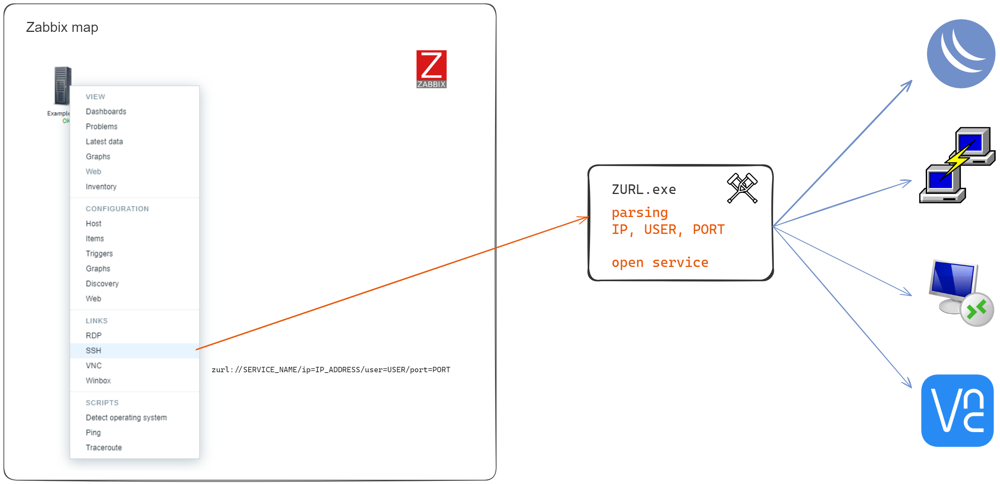
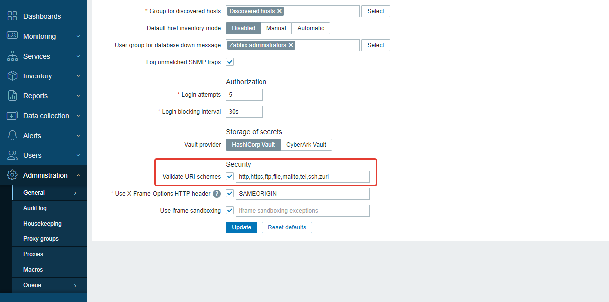
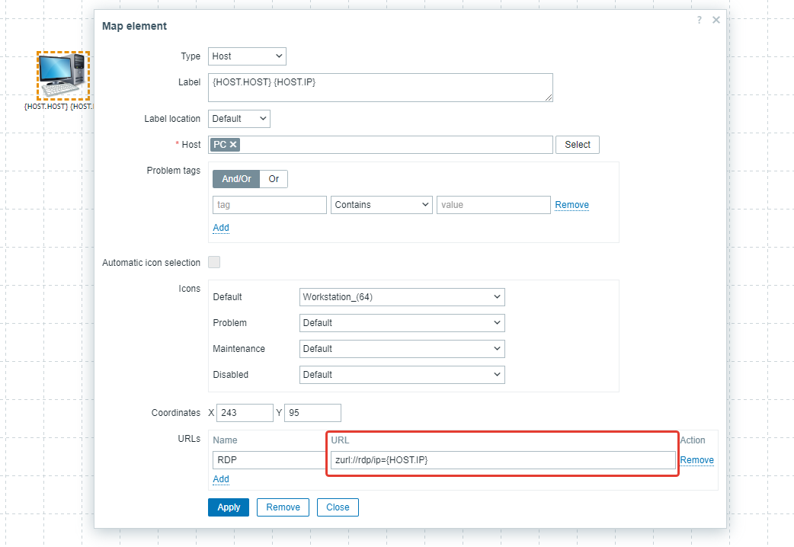
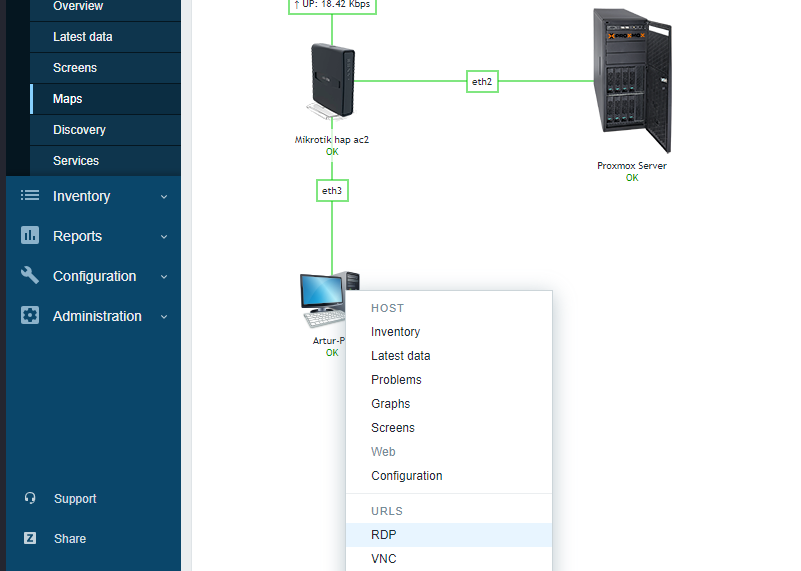
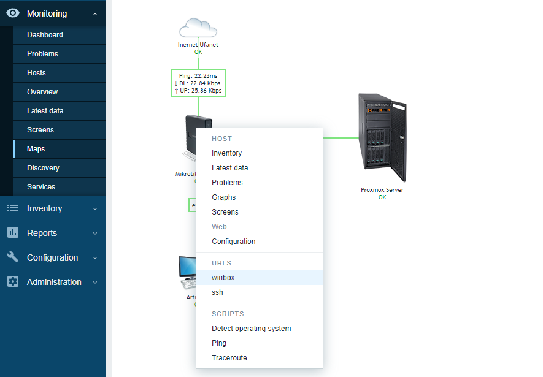

# Zabbix URL to open other app
## Open winbox ssh rdp vnc from map


It only works on Windows OS

**Feature**:

Quick launch (with one click on the map) of programs from the list:
- Winbox
- Putty
- VNC
- RDP
- WinMTR


## Guide

### 1. Copy project

Need Path `C:\zurl`

```shell
git clone https://github.com/akmalovaa/zabbix-url.git C:\zurl
```

> If you need to use a different path, edit in the code and run the build in .exe


### 2. Add zurl protocol Windows Registry

Run file `zurl_registry.reg`

### 3. Zabbix configuration parameters


`Administration -> General -> Other`

Add Validate URI schemes: `zurl`




### 4. Zabbix map add url to app

Edit the host settings on the map

**Format:**
```
zurl://SERVICE_NAME/ip=IP_ADDRESS/user=USER/password=PASSWORD/port=PORT
```

#### Examples:


**Winbox**
```
zurl://winbox/ip=10.0.0.1
zurl://winbox/ip=10.0.0.1/user=admin
zurl://winbox/ip=10.0.0.1/user=admin/password=12345
```

**Putty**
```
zurl://putty/ip=10.0.0.1
zurl://putty/ip=10.0.0.1/user=root
zurl://putty/ip=10.0.0.1/user=root/port=22
```

**VNC**
```
zurl://vnc/ip=10.0.0.1/port=5900
```

**WinMTR**
```
zurl://mtr/ip=10.0.0.1
```

**RDP**
```
zurl://rdp/ip=10.0.0.1
```

you can use zabbix variables for example {HOST.IP}






## For development build zurl.exe

A .py to .exe converter using a simple interface and PyInstaller in Python.

Install:
```shell
pip install auto-py-to-exe
```

Run:
```shell
auto-py-to-exe
```